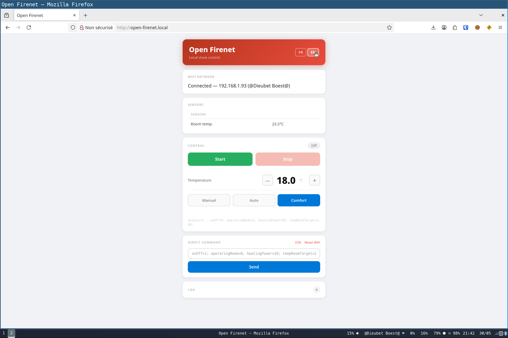
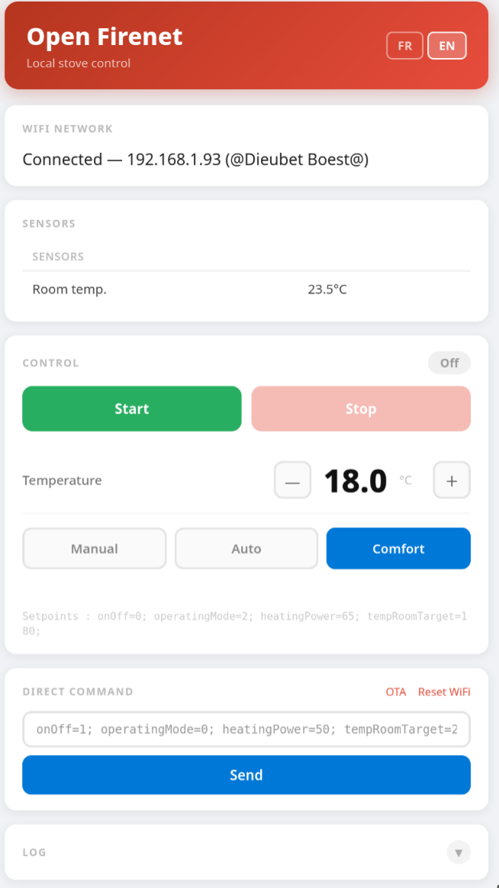
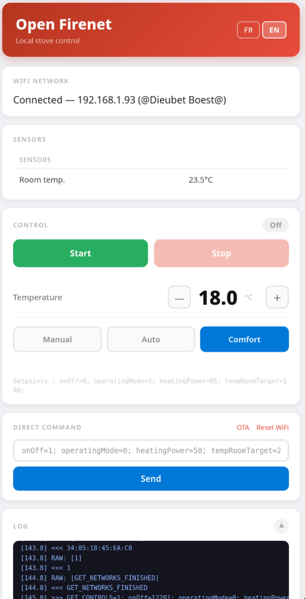
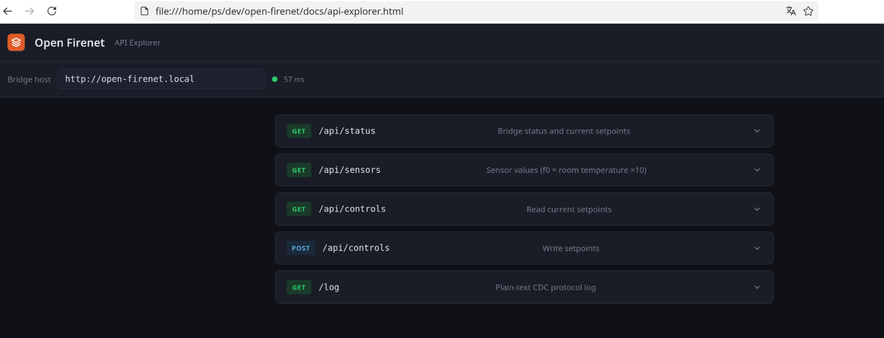
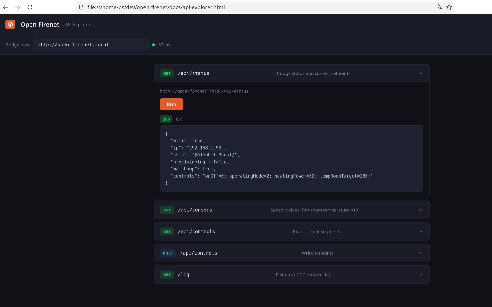

# Open Firenet

Local WiFi bridge for RIKA pellet stoves — replaces the proprietary Firenet 2.0 cloud dongle with an ESP32-S3 that exposes a local REST API and web interface.

No cloud account. No internet dependency. Works on your LAN.

> **Disclaimer** — This project is not affiliated with or endorsed by RIKA Innovative Ofentechnik GmbH. The protocol was reverse-engineered for interoperability purposes only. Use at your own risk. No warranty of any kind is provided.

---

## What it does

RIKA stoves use a USB CDC dongle (the "Firenet 2.0" stick) to connect to RIKA's cloud. This project replaces that dongle with an ESP32-S3 that:

- Speaks the same USB CDC protocol as the original dongle
- Connects to your home WiFi
- Exposes a local web interface at `http://open-firenet.local`
- Exposes a REST API for home automation (Home Assistant, etc.)
- Stores all state locally — no external dependency

---

## Hardware

> **Tested hardware only** — This firmware has only been tested on an ESP32-S3. Other ESP32-S3 boards will likely work. The ESP32-S2 also has native USB OTG and may work but is untested. ESP32, ESP32-C3, and other variants without native USB OTG will not work.

### Required

| Part | Notes |
|---|---|
| ESP32-S3 dev board with native USB | The board must expose the S3's USB OTG pins (GPIO19/20 = D+/D−) on its USB connector. Any connector type works (USB-A, USB-C, Micro-B) as long as it is wired to the S3's native USB, not to a UART bridge chip. |
| Cable to stove | The stove has a USB-A socket. Use whatever cable or adapter connects your board's USB port to USB-A Male (e.g. USB-C to USB-A, or USB-A to USB-A). |

### How it connects

The stove acts as USB host; the ESP32-S3 acts as USB device (CDC class). The firmware registers VID `0x303A` / PID `0x819A` to match the original dongle and be recognized by the stove's firmware.

### What to look for when buying

- The board **must** have the ESP32-S3 chip (not ESP32, S2, or C3)
- The board **must** expose native USB OTG — **not** a UART bridge (CH340, CP2102, etc.)
- Check the schematic or product page: the native USB port is labeled "USB OTG", "USB", or connects to GPIO19/20; the UART port is labeled "UART", "COM", or connects to a bridge chip

---

## Flashing

### Linux (recommended)

**Requirements:** `arduino-cli`, `esptool`, ESP32 Arduino core 3.x

```bash
chmod +x flash.sh
./flash.sh                       # serial flash via /dev/ttyACM0
./flash.sh /dev/ttyACM1          # specify serial port
./flash.sh --ota 192.168.1.x     # OTA flash via WiFi (once already running)
```

The script compiles then flashes bootloader + partition table + app. The NVS partition (WiFi credentials) is **preserved** across flashes.

---

### macOS

**Requirements:** [arduino-cli](https://arduino.github.io/arduino-cli/installation/), [esptool](https://docs.espressif.com/projects/esptool/en/latest/esp32/installation.html), ESP32 Arduino core 3.x

Install dependencies via Homebrew:

```bash
brew install arduino-cli esptool
arduino-cli core install esp32:esp32
```

The serial port is named differently on macOS — find it with:

```bash
ls /dev/cu.usbmodem*
```

Then flash:

```bash
chmod +x flash.sh
./flash.sh /dev/cu.usbmodem14101   # adjust to your port
./flash.sh --ota 192.168.1.x       # or OTA if already running
```

---

### Windows

The `flash.sh` script requires a bash shell. Two options:

**Option A — WSL (Windows Subsystem for Linux)**

Install WSL2 then follow the Linux instructions above. To forward the USB serial port to WSL, use [usbipd](https://github.com/dorssel/usbipd-win):

```powershell
# In PowerShell (admin)
usbipd list                     # find the ESP32 busid
usbipd attach --wsl --busid <busid>
```

Then inside WSL:
```bash
./flash.sh /dev/ttyACM0
```

**Option B — Flash a pre-built binary with esptool**

1. Install [Python](https://python.org) and esptool:
   ```powershell
   pip install esptool
   ```
2. Download the latest `.bin` from [Releases](../../releases) (or build it on Linux/macOS).
3. Find your COM port in Device Manager (e.g. `COM4`).
4. Flash:
   ```powershell
   esptool --chip esp32s3 --port COM4 --baud 460800 `
     --before default-reset --after hard-reset `
     write-flash --flash-mode dio --flash-freq 80m --flash-size 4MB `
     0x0000 open-firenet.ino.bootloader.bin `
     0x8000 open-firenet.ino.partitions.bin `
     0x10000 open-firenet.ino.bin
   ```

> **OTA is the easiest path on Windows** — flash once via serial (Option A or B), then all subsequent updates work via `./flash.sh --ota <ip>` from any platform, or directly through the `/update` page in the browser.

---

## First boot — WiFi provisioning

On first boot the bridge has no WiFi credentials and enters **provisioning mode**.

Two ways to provision:

### Option A — Stove screen (no PC needed)
1. On the stove, go to **Settings → WiFi** and select your network.
2. The stove sends the credentials over USB CDC to the bridge.
3. The bridge connects and shows a connected icon on the stove screen.

### Option B — Serial command (useful for testing)
Send via the serial port (`/dev/ttyACM0`, 115200 baud):
```
SETWIFI:YourSSID:YourPassword
```

---

## Web interface

Once connected, open `http://open-firenet.local` in a browser (or use the IP shown in the serial log).

<p align="center">
  
  
</p>

- **FR / EN** language toggle in the header
- **Start / Stop** — disabled when the stove is already in that state
- **Temperature** slider — shown in Comfort mode only
- **Power** slider — shown in Manual and Auto modes
- **Mode** — Manuel / Auto / Confort (operatingMode 0 / 1 / 2)
- **Log** — collapsible, shows the live CDC protocol log

<p align="center">
  
</p>

- **OTA** — firmware update via browser at `/update`

---

## REST API

| Endpoint | Method | Description |
|---|---|---|
| `/api/status` | GET | JSON: wifi, ip, ssid, provisioning, mainLoop, controls |
| `/api/sensors` | GET | JSON: sensor fields from POST_SENSORS (f0 = room temp ×10) |
| `/api/controls` | GET | JSON: current setpoints (`onOff`, `operatingMode`, `heatingPower`, `tempRoomTarget`) |
| `/api/controls` | POST | Set controls — body: `onOff=1; operatingMode=1; heatingPower=50; tempRoomTarget=210;` |
| `/log` | GET | Plain-text log |
| `/update` | GET/POST | OTA firmware update page |
| `/reset-wifi` | GET | Erase WiFi credentials and reboot |

### Controls format
```
onOff=<0|1>; operatingMode=<0|1|2>; heatingPower=<50-100>; tempRoomTarget=<140-280>;
```
`tempRoomTarget` is ×10 (210 = 21.0 °C). `heatingPower` is % (50–100, values below 50 are clamped to 50).

### Operating modes
| Value | Mode |
|---|---|
| 0 | Manual (fixed power %) |
| 1 | Auto / thermostat |
| 2 | Comfort |

### API Explorer

`docs/api-explorer.html` is a standalone browser-based tool for exploring the API against your running bridge.

<p align="center">
  
  
</p>

Open it from the repo (no server needed — it runs entirely in the browser):

```bash
open docs/api-explorer.html       # macOS
xdg-open docs/api-explorer.html   # Linux
```

Or, if the repo is published on GitHub Pages, the explorer is available at:
```
https://<your-org>.github.io/<repo>/docs/api-explorer.html
```

Enter your bridge address (`http://open-firenet.local` or the IP) in the host field at the top. The explorer checks connectivity on load and shows latency. Each endpoint has a collapsible panel with a **Run** button — the POST controls panel includes form fields for all setpoints.

> **Note:** The bridge serves CORS headers (`Access-Control-Allow-Origin: *`) so the explorer can reach it from any origin, including `file://`.

---

## Protocol

See [PROTOCOL.md](PROTOCOL.md) for the full reverse-engineered USB CDC protocol specification.

Key facts:
- ASCII line-oriented over USB CDC
- Stove is USB host, dongle is USB device
- All commands terminated with `\n` or `\r\n`
- `tempRoomTarget` is always ×10 on the wire
- `POST_CONTROLS` does not reflect the values just written — it returns the stove's own stored values

---

## Home Assistant

Example REST sensor for room temperature:

```yaml
sensor:
  - platform: rest
    resource: http://open-firenet.local/api/sensors
    name: Stove room temperature
    value_template: "{{ (value_json.f0 | int / 10) | round(1) }}"
    unit_of_measurement: "°C"
    scan_interval: 60

rest_command:
  rika_start:
    url: "http://open-firenet.local/api/controls"
    method: POST
    payload: "onOff=1; operatingMode=1; heatingPower=50; tempRoomTarget=210;"
    content_type: text/plain
  rika_stop:
    url: "http://open-firenet.local/api/controls"
    method: POST
    payload: "onOff=0; operatingMode=1; heatingPower=50; tempRoomTarget=210;"
    content_type: text/plain
```

---

## License

GNU Affero General Public License v3.0 or later (AGPL-3.0-or-later) — see [LICENSE](LICENSE)

Any derivative work, including commercial forks, must be distributed under the same license with the full source code made available.
