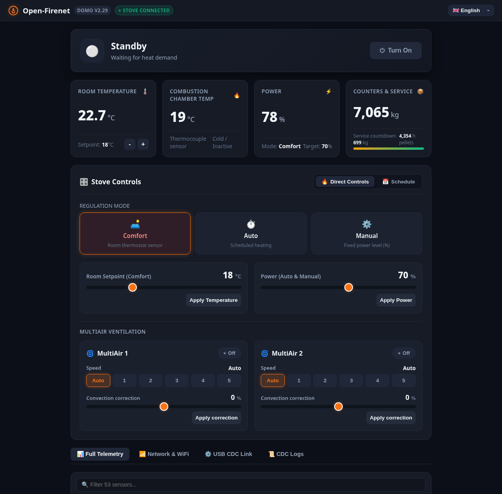
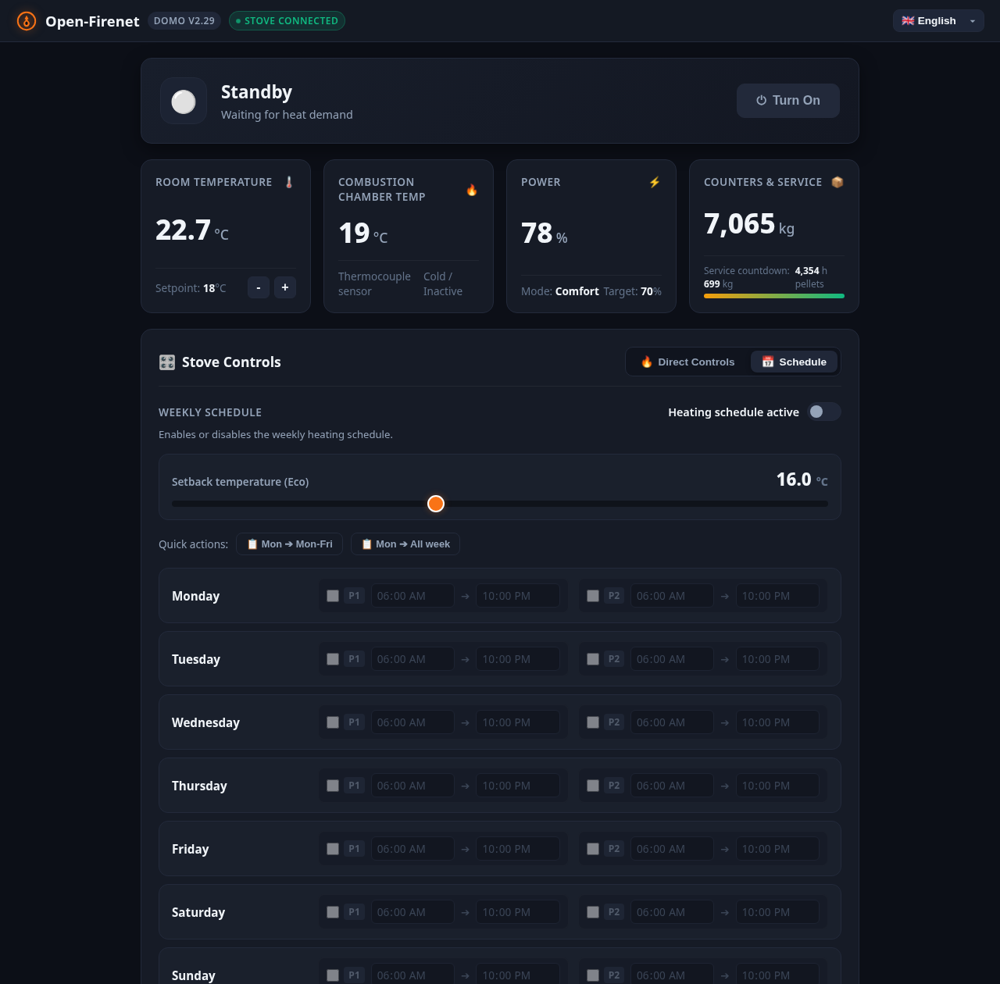
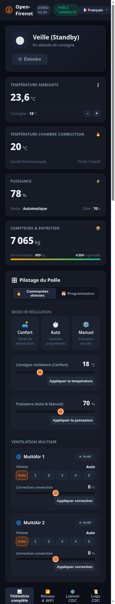

# Open Firenet

<p align="center">
  
</p>

Local WiFi bridge for RIKA pellet stoves — replaces the proprietary Firenet 2.0 cloud dongle with an ESP32-S3 that exposes a local REST API and web interface.

No cloud account. No internet dependency. Works on your LAN.

> **Disclaimer** — This project is not affiliated with or endorsed by RIKA Innovative Ofentechnik GmbH. The protocol was reverse-engineered for interoperability purposes only. Use at your own risk. No warranty of any kind is provided.

---

## What it does

RIKA stoves use a USB CDC dongle (the "Firenet 2.0" stick) to connect to RIKA's cloud. This project replaces that dongle with an ESP32-S3 that:

- Speaks the same USB CDC protocol as the original dongle
- Connects to your home WiFi
- Exposes a responsive local web interface at `http://open-firenet.local` with direct controls, weekly heating schedule, and live diagnostics
- Controls **MultiAir 1 & 2** forced-air convection fans on supported stove models (DOMO, PARO, ROCO MULTIAIR, SUMO MULTIAIR, DOMO BACK)
- Manages the **7-day heating schedule** (14 time slots) and setback / maintenance temperature locally
- Exposes a comprehensive REST API for home automation (Home Assistant, Node-RED, etc.)
- Stores all state locally — no cloud account, no internet dependency, 100% private

---

## Hardware

> **Tested hardware only** — This firmware has only been tested on an ESP32-S3. Other ESP32-S3 boards will likely work. The ESP32-S2 also has native USB OTG and may work but is untested. ESP32, ESP32-C3, and other variants without native USB OTG will not work.

### Required

| Part | Notes |
|---|---|
| ESP32-S3 dev board with native USB | The board must expose the S3's USB OTG pins (GPIO19/20 = D+/D−) on its USB connector. Any connector type works (USB-A, USB-C, Micro-B) as long as it is wired to the S3's native USB, not to a UART bridge chip. |
| Cable to stove | The stove has a USB-A socket. Use whatever cable or adapter connects your board's USB port to USB-A Male (e.g. USB-C to USB-A, or USB-A to USB-A). |

### How it connects

The stove acts as USB host; the ESP32-S3 acts as USB device (CDC class). The firmware registers VID `0x303A` / PID `0x819A` to match the original dongle and be recognized by the stove's firmware.

### What to look for when buying

- The board **must** have the ESP32-S3 chip (not ESP32, S2, or C3)
- The board **must** expose native USB OTG — **not** a UART bridge (CH340, CP2102, etc.)
- Check the schematic or product page: the native USB port is labeled "USB OTG", "USB", or connects to GPIO19/20; the UART port is labeled "UART", "COM", or connects to a bridge chip

---

## Flashing & Installation

### Option 1 — Open-Firenet Installer (GUI & CLI — Recommended)

The easiest and recommended way to install, flash, configure, and wirelessly update your Open-Firenet dongle on **Windows**, **macOS**, and **Linux** without needing Python, `arduino-cli`, or `esptool`.

Download the standalone executable for your operating system from [**Open-Firenet Installer Releases**](https://github.com/openfirenet/open-firenet-installer/releases):

| Operating System | Pre-compiled Standalone Binary |
|---|---|
| **Windows (x86_64)** | `open-firenet-installer-windows-x86_64.exe` |
| **macOS Apple Silicon (M1/M2/M3/M4)** | `open-firenet-installer-macos-arm64` |
| **macOS Intel (x86_64)** | `open-firenet-installer-macos-x86_64` |
| **Linux (x86_64)** | `open-firenet-installer-linux-x86_64` |

**Key Capabilities:**
- 🔍 **Auto-detection**: Automatically discovers connected ESP32-S3 serial ports and scans your local network for existing dongles.
- 📦 **Automated Downloads & Verification**: Pulls official release binaries and validates integrity via **Minisign** cryptographic signatures and SHA-256 checksums.
- ⚡ **1-Click Flash**: Safe flashing with choice between *Update* (keeps stored Wi-Fi config) and *Full Factory Reset*.
- 📶 **USB Wi-Fi Configuration**: Easily set your home Wi-Fi SSID and password over serial.
- 📡 **Wireless OTA Updates**: Update the dongle remotely over Wi-Fi when already installed on your stove.

👉 Full documentation and source code: [**openfirenet/open-firenet-installer**](https://github.com/openfirenet/open-firenet-installer)

---

### Option 2 — Manual flashing scripts (Developers / Advanced users)

#### Linux

**Requirements:** `arduino-cli`, `esptool`, ESP32 Arduino core 3.x

```bash
chmod +x flash.sh
./flash.sh                       # serial flash via /dev/ttyACM0
./flash.sh /dev/ttyACM1          # specify serial port
./flash.sh --ota 192.168.1.x     # OTA flash via WiFi (once already running)
```

The script compiles then flashes bootloader + partition table + app. The NVS partition (WiFi credentials) is **preserved** across flashes.

---

#### macOS

**Requirements:** [arduino-cli](https://arduino.github.io/arduino-cli/installation/), [esptool](https://docs.espressif.com/projects/esptool/en/latest/esp32/installation.html), ESP32 Arduino core 3.x

Install dependencies via Homebrew:

```bash
brew install arduino-cli esptool
arduino-cli core install esp32:esp32
```

The serial port is named differently on macOS — find it with:

```bash
ls /dev/cu.usbmodem*
```

Then flash:

```bash
chmod +x flash.sh
./flash.sh /dev/cu.usbmodem14101   # adjust to your port
./flash.sh --ota 192.168.1.x       # or OTA if already running
```

---

#### Windows

The `flash.sh` script requires a bash shell. Two options:

**Option A — WSL (Windows Subsystem for Linux)**

Install WSL2 then follow the Linux instructions above. To forward the USB serial port to WSL, use [usbipd](https://github.com/dorssel/usbipd-win):

```powershell
# In PowerShell (admin)
usbipd list                     # find the ESP32 busid
usbipd attach --wsl --busid <busid>
```

Then inside WSL:
```bash
./flash.sh /dev/ttyACM0
```

**Option B — Flash a pre-built binary with esptool**

1. Install [Python](https://python.org) and esptool:
   ```powershell
   pip install esptool
   ```
2. Download the latest `.bin` from [Releases](../../releases) (or build it on Linux/macOS).
3. Find your COM port in Device Manager (e.g. `COM4`).
4. Flash:
   ```powershell
   esptool --chip esp32s3 --port COM4 --baud 460800 `
     --before default-reset --after hard-reset `
     write-flash --flash-mode dio --flash-freq 80m --flash-size 4MB `
     0x0000 open-firenet.ino.bootloader.bin `
     0x8000 open-firenet.ino.partitions.bin `
     0x10000 open-firenet.ino.bin
   ```

> **OTA is the easiest path on Windows** — flash once via serial (Option A or B), then all subsequent updates work via `./flash.sh --ota <ip>` from any platform, or directly through the `/update` page in the browser.

---

## First boot — WiFi provisioning

On first boot (or if credentials were reset), the bridge enters **provisioning mode** with its own Wi-Fi Access Point: **`Open-Firenet-Setup`** (open network, no password).

Two ways to provision:

### Option A — Captive Portal (smartphone or PC, recommended)
1. Connect your phone or laptop to the Wi-Fi network **`Open-Firenet-Setup`**.
2. The captive portal opens automatically (or browse to `http://open-firenet.local` or `http://192.168.4.1`).
3. Select your 2.4 GHz home Wi-Fi from the scanned networks list, enter your Wi-Fi password, and click **Enregistrer / Connect**.
4. The dongle reboots, connects to your LAN, and becomes available at **`http://open-firenet.local`**.

### Option B — Serial command (for lab / debugging)
Connect to the ESP32-S3 serial port (`115200 baud`) and send:
```
SETWIFI:YourSSID:YourPassword
```
The SSID ends at the first `:`; everything after it is the password (so a password containing `:` is accepted). Credentials are saved to NVS and the bridge reboots into STA mode.

---

## Web interface

Once connected, open **`http://open-firenet.local`** in any web browser (or use the device IP assigned by your router).

<p align="center">
  
</p>

- **Modern glassmorphism UI**: mobile-first, responsive dark theme.
- **Language selector with flags**: 🇫🇷 Français / 🇬🇧 English instant toggle.
- **Live stove status header**: operational state badges (Standby, Ignition, Start, Regulation, Cleaning, Burnoff, Splitlog), room temperature, flame temperature, Wi-Fi RSSI.
- **Control Deck ("Pilotage du Poêle")** with segmented navigation:
  - **🔥 Commandes directes**:
    - Power **ON / OFF** toggle
    - **Operating Mode**: Manuel, Auto (Thermostat), Confort
    - **Target Room Temperature**: slider & stepper 14.0°C – 28.0°C (in Confort mode)
    - **Heating Power**: slider & stepper 30% – 100% (in Manuel / Auto modes)
    - **MultiAir 1 & 2** (dynamically displayed for MultiAir-equipped models):
      - Fan On / Off toggle
      - Speed regulation: **Auto** mode vs **Manual** levels 1 to 5
      - Convection trim / correction slider: **-30% to +30%**

<p align="center">
  
</p>

  - **📅 Programmation (Chauffage hebdomadaire)**:
    - Independent schedule activation toggle (**Activer la programmation**) — works across all heating modes
    - **Température de maintien (Éco)**: setback temperature applied outside scheduled heating slots (10.0°C – 25.0°C)
    - **14 Weekly time slots** (2 slots per day, Monday to Sunday):
      - Native HTML5 time pickers (`HH:MM` start and end)
      - Quick copy actions (e.g. Monday $\rightarrow$ Weekdays or Full Week)
      - Per-day clear button (quick reset)
      - Single-click bulk apply with immediate CDC synchronization
- **Supervision & Diagnostics Deck**:
  - **Télémétrie**: live metrics table (temperatures, combustion chamber, pellet consumption, auger & exhaust fan RPM, runtime hours, service countdown, error and warning bitmasks)
  - **Réseau & Wi-Fi**: IP, MAC address, signal strength, AP scan, Wi-Fi reconfiguration & reset
  - **Liaison CDC**: USB CDC state, packet counters, protocol revision
  - **Logs CDC**: collapsible real-time console streaming raw bidirectional USB packets with sanitized WiFi credentials

### Mobile Interface

<p align="center">
  
</p>

---

## MultiAir Compatibility

MultiAir forced convection fans are automatically detected and displayed in the Web UI based on the stove model ID reported by the main board:

| Model ID | Model Name | MultiAir Hardware |
|:---:|:---|:---|
| **`4`** | **RIKA ROCO MULTIAIR** | MultiAir 1 & 2 |
| **`13`** | **RIKA DOMO** | MultiAir 1 & 2 |
| **`17`** | **RIKA PARO** | MultiAir 1 & 2 |
| **`23`** | **RIKA DOMO BACK** | MultiAir 1 & 2 |
| **`25`** | **RIKA SUMO MULTIAIR** | MultiAir 1 & 2 |

*Stoves with natural convection only (e.g. FILO, COMO, REVO, CORSO) automatically hide the MultiAir control card in the Web UI to keep the interface simple and clutter-free.*

---

## REST API V2

Open-Firenet V2 provides a clean, unified REST JSON API with natural units (temperatures in °C as floats, power as percentage integers, clean mode strings):

| Endpoint | Method | Description |
|---|---|---|
| `/api/state` | GET | **V2 Unified state**: device info, stove telemetry, sensors, controls, and MultiAir / schedule status |
| `/api/controls` | GET | Current controls in JSON format |
| `/api/controls` | POST | **Set controls**: accepts clean JSON payload (partial updates supported) |
| `/api/schedule` | GET | **Weekly schedule**: active toggle, setback temperature, and 14 time slots |
| `/api/schedule` | POST | Update weekly schedule, slot timings, and setback temperature |
| `/api/version` | GET | Firmware version, build date, and target platform |
| `/api/restart` | POST | Software restart of the ESP32 bridge |
| `/api/status` | GET | *Legacy* status endpoint (retained for backward compatibility) |
| `/api/sensors` | GET | *Legacy* sensors endpoint (retained for backward compatibility) |
| `/reset-wifi` | GET / POST | Erase Wi-Fi credentials from NVS and reboot into provisioning AP |
| `/log` | GET | Plain-text live USB CDC debug log |

### `GET /api/state` example

```json
{
  "device": {
    "status": "connected",
    "rssi": -62,
    "ip": "192.168.1.93",
    "mac": "84:FC:E6:XX:XX:XX",
    "uptime_ms": 348210
  },
  "stove": {
    "online": true,
    "state": "regulation",
    "state_code": 3,
    "igniter_on": false,
    "error_mask": 0,
    "warning_mask": 0,
    "model": 13,
    "model_name": "RIKA DOMO",
    "mainboard_version": "2.29",
    "firmware_build": "58512"
  },
  "sensors": {
    "room_temperature": 20.4,
    "combustion_temperature": 412.0,
    "board_temperature": 32.5,
    "pellets_total_kg": 2450,
    "pellet_hours": 1250,
    "service_countdown_kg": 550,
    "fan_speed_rpm": 1450,
    "auger_speed_rpm": 420
  },
  "controls": {
    "on": true,
    "mode": "comfort",
    "mode_code": 2,
    "target_temperature": 21.0,
    "power_percent": 70,
    "heating_times_active": true,
    "setback_temperature": 16.0,
    "convection_fan1_active": true,
    "convection_fan1_level": 0,
    "convection_fan1_area": 10,
    "convection_fan2_active": false,
    "convection_fan2_level": 0,
    "convection_fan2_area": 0
  }
}
```

### `POST /api/controls` (Direct controls & MultiAir)

Send a JSON object with `Content-Type: application/json`. Partial updates are fully supported:

```bash
# Set target temperature to 21.0 °C in Comfort mode
curl -X POST http://open-firenet.local/api/controls \
  -H "Content-Type: application/json" \
  -d '{"target_temperature": 21.0, "mode": "comfort"}'

# Turn the stove ON at 80% power
curl -X POST http://open-firenet.local/api/controls \
  -H "Content-Type: application/json" \
  -d '{"on": true, "power_percent": 80}'

# Configure MultiAir Fan 1: turn ON in Auto mode with +10% convection trim
curl -X POST http://open-firenet.local/api/controls \
  -H "Content-Type: application/json" \
  -d '{
    "convectionFan1Active": true,
    "convectionFan1Level": 0,
    "convectionFan1Area": 10
  }'
```

Supported fields:
- **Power & Mode**:
  - `on` (or `onOff`): boolean or `0`/`1`
  - `mode`: string (`"manual"`, `"auto"`, `"comfort"`) or integer (`0`, `1`, `2`)
  - `power_percent` (or `power`, `heatingPower`, `targetStage`): integer (`30` – `100`)
  - `target_temperature` (or `temperature`, `roomTarget`): float in °C (`14.0` – `28.0`)
- **MultiAir Fans (1 & 2)**:
  - `convectionFan1Active` / `convectionFan2Active`: boolean or `0`/`1`
  - `convectionFan1Level` / `convectionFan2Level`: integer (`0` = Auto, `1`–`5` = manual speed level)
  - `convectionFan1Area` / `convectionFan2Area`: integer (`-30` to `+30`%)

---

### Weekly Heating Schedule API (`/api/schedule`)

The heating schedule controls heating windows across the 7 days of the week (2 slots per day). Time slots are encoded over the wire as decimal integers: `(StartHH * 100 + StartMM) * 10000 + (EndHH * 100 + EndMM)`. For example, `06:00` to `08:30` is encoded as `6000830`, and `0` indicates a disabled slot.

#### `GET /api/schedule`

```bash
curl http://open-firenet.local/api/schedule
```

Example response:
```json
{
  "ok": true,
  "active": true,
  "heatingTimesActive": 1,
  "setback_temperature": 16.0,
  "setBackTemp": 160,
  "slots": {
    "heatTimeMon1": 6000800,
    "heatTimeMon2": 17002200,
    "heatTimeTue1": 6000800,
    "heatTimeTue2": 17002200,
    "heatTimeWed1": 6000800,
    "heatTimeWed2": 17002200,
    "heatTimeThu1": 6000800,
    "heatTimeThu2": 17002200,
    "heatTimeFri1": 6000800,
    "heatTimeFri2": 23002330,
    "heatTimeSat1": 7302300,
    "heatTimeSat2": 0,
    "heatTimeSun1": 8002230,
    "heatTimeSun2": 0
  }
}
```

#### `POST /api/schedule`

Partial updates are supported. You can activate/deactivate the schedule, adjust the setback temperature, and modify individual slots:

```bash
# Enable schedule, set setback temperature to 16.5 °C, and program Monday slot 1 (06:30 -> 08:30)
curl -X POST http://open-firenet.local/api/schedule \
  -H "Content-Type: application/json" \
  -d '{
    "heatingTimesActive": true,
    "setback_temperature": 16.5,
    "heatTimeMon1": 6300830
  }'

# Disable Tuesday slot 2
curl -X POST http://open-firenet.local/api/schedule \
  -H "Content-Type: application/json" \
  -d '{"heatTimeTue2": 0}'
```

Supported fields:
- `heatingTimesActive` (or `scheduleActive`): boolean or `0`/`1`
- `setback_temperature` (or `setBackTemp`): float in °C (e.g. `16.5`) or raw integer ×10 (`165`)
- `heatTimeMon1`, `heatTimeMon2`, `heatTimeTue1`, ..., `heatTimeSun2`: integer slot encoding (`0` = disabled)


---

## Home Assistant Integration

For Home Assistant, use the official custom integration repository:  
**[openfirenet/open-firenet-ha](https://github.com/openfirenet/open-firenet-ha)**

Features:
- Single-step setup via UI Config Flow (enter `http://open-firenet.local` or IP)
- Native **Climate** entity (`climate.stove`) with target temperature, presets (`manual`, `auto`, `comfort`), and heating power
- **MultiAir 1 & 2 Fan entities**: fan speed controls, auto regulation toggle, and convection trim controls
- **Weekly Schedule entities**: heating schedule toggle, setback temperature control, and time slot configurations
- **11 native sensor entities**: room temperature, flame temperature, operational state, sub-state, Wi-Fi RSSI, runtime, pellet consumption, error masks
- **Binary sensors**: Stove connection, combustion active, error status
- Real-time updates via asynchronous polling of the V2 API without cloud lag

---

## License

GNU Affero General Public License v3.0 or later (AGPL-3.0-or-later) — see [LICENSE](LICENSE)

Any derivative work, including commercial forks, must be distributed under the same license with the full source code made available.
