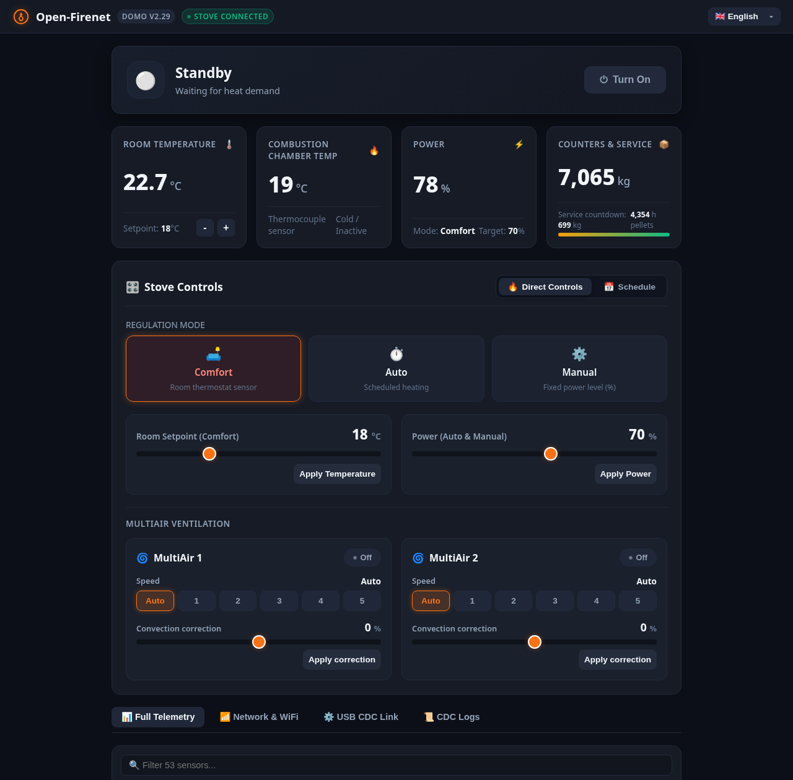
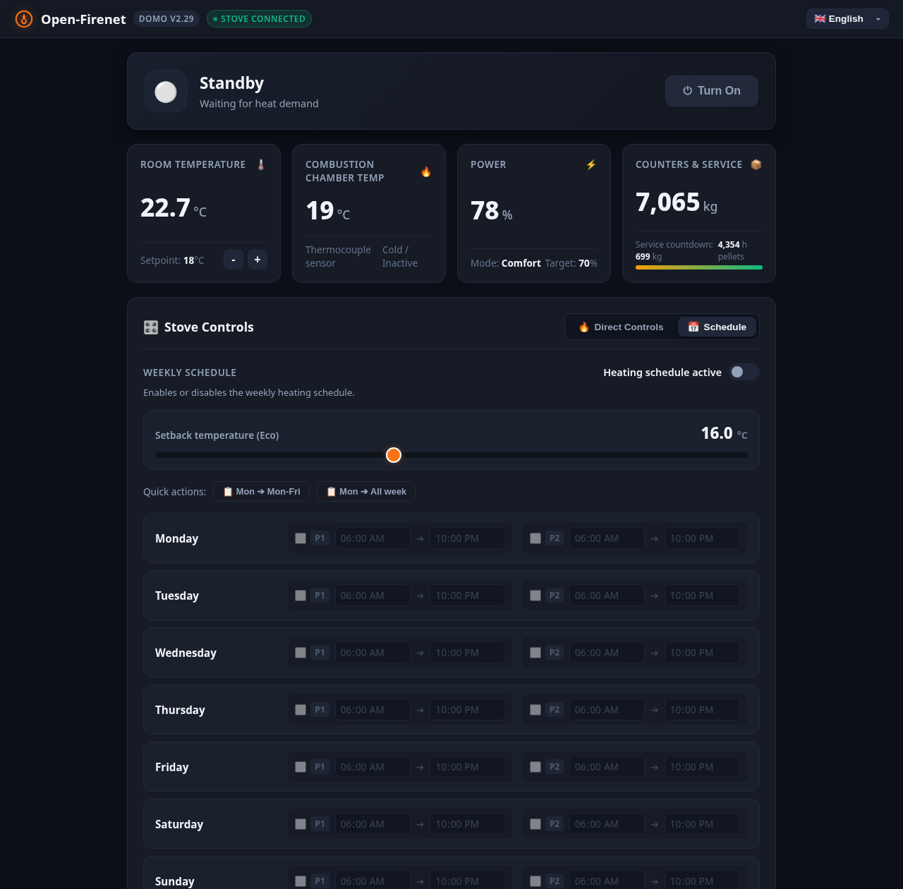
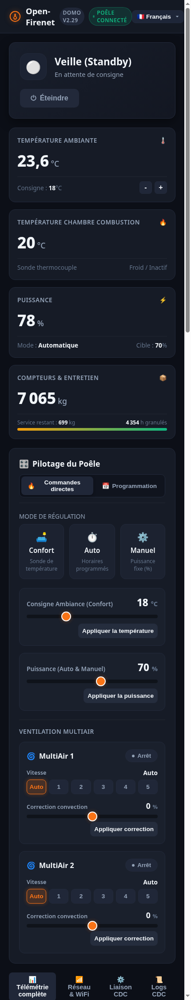

# Open Firenet

<p align="center">
  
</p>

Local WiFi bridge for RIKA pellet stoves — replaces the proprietary Firenet 2.0 cloud dongle with an ESP32-S3 that exposes a local REST API and web interface.

No cloud account. No internet dependency. Works on your LAN.

> **Disclaimer** — This project is not affiliated with or endorsed by RIKA Innovative Ofentechnik GmbH. The protocol was reverse-engineered for interoperability purposes only. Use at your own risk. No warranty of any kind is provided.

---

## What it does

RIKA stoves use a USB CDC dongle (the "Firenet 2.0" stick) to connect to RIKA's cloud. This project replaces that dongle with an ESP32-S3 that:

- Speaks the same USB CDC protocol as the original dongle, and detects by itself which protocol generation your stove uses (see [Stove compatibility](#stove-compatibility))
- Connects to your home WiFi
- Exposes a responsive local web interface at `http://open-firenet.local` with direct controls, weekly heating schedule, and live diagnostics
- Controls **MultiAir 1 & 2** forced-air convection fans on stoves that have them (see [MultiAir compatibility](#multiair-compatibility))
- Manages the **7-day heating schedule** (14 time slots) and setback / maintenance temperature locally
- Reads every value the stove reports (88 records, named after the official RIKA names) and the stove settings, including frost protection, room sensor calibration, eco mode, warnings and air flaps
- Exposes a comprehensive REST API for home automation (Home Assistant, Node-RED, etc.)
- Rejoins your Wi-Fi by itself after a drop, and answers only its own page and programs on your network, not pages of other websites (see [Who can call the API](#who-can-call-the-api))
- Stores all state locally — no cloud account, no internet dependency, 100% private

---

## Hardware

> **Tested hardware only** — This firmware has only been tested on an ESP32-S3. Other ESP32-S3 boards will likely work. The ESP32-S2 also has native USB OTG and may work but is untested. ESP32, ESP32-C3, and other variants without native USB OTG will not work.

### Required

| Part | Notes |
|---|---|
| ESP32-S3 dev board with native USB | The board must expose the S3's USB OTG pins (GPIO19/20 = D+/D−) on its USB connector. Any connector type works (USB-A, USB-C, Micro-B) as long as it is wired to the S3's native USB, not to a UART bridge chip. |
| Cable to stove | The stove has a USB-A socket. Use whatever cable or adapter connects your board's USB port to USB-A Male (e.g. USB-C to USB-A, or USB-A to USB-A). |

### How it connects

The stove acts as USB host; the ESP32-S3 acts as USB device (CDC class, VID `0x303A` / PID `0x819A`). The stove does not check the VID/PID: it only needs a CDC data interface, which the firmware provides.

### What to look for when buying

- The board **must** have the ESP32-S3 chip (not ESP32, S2, or C3)
- The board **must** expose native USB OTG — **not** a UART bridge (CH340, CP2102, etc.)
- Check the schematic or product page: the native USB port is labeled "USB OTG", "USB", or connects to GPIO19/20; the UART port is labeled "UART", "COM", or connects to a bridge chip

---

## Flashing & Installation

### Option 1 — Open Firenet Installer (GUI & CLI — Recommended)

The easiest and recommended way to install, flash, configure, and wirelessly update your Open Firenet dongle on **Windows**, **macOS**, and **Linux** without needing Python, `arduino-cli`, or `esptool`.

Download the standalone executable for your operating system from [**Open Firenet Installer Releases**](https://github.com/openfirenet/open-firenet-installer/releases):

| Operating System | Pre-compiled Standalone Binary |
|---|---|
| **Windows (x86_64)** | `open-firenet-installer-windows-x86_64.exe` |
| **macOS Apple Silicon (M1/M2/M3/M4)** | `open-firenet-installer-macos-arm64` |
| **macOS Intel (x86_64)** | `open-firenet-installer-macos-x86_64` |
| **Linux (x86_64)** | `open-firenet-installer-linux-x86_64` |

**Key Capabilities:**
- 🔍 **Auto-detection**: Automatically discovers connected ESP32-S3 serial ports and scans your local network for existing dongles.
- 📦 **Automated Downloads & Verification**: Pulls official release binaries and validates integrity via **Minisign** cryptographic signatures and SHA-256 checksums.
- ⚡ **1-Click Flash**: Safe flashing with choice between *Update* (keeps stored Wi-Fi config) and *Full Factory Reset*.
- 📶 **USB Wi-Fi Configuration**: Easily set your home Wi-Fi SSID and password over serial.
- 📡 **Wireless OTA Updates**: Update the dongle remotely over Wi-Fi when already installed on your stove.
- 🔑 **Update password** (optional, firmware 4.0): set over USB, then asked for at each wireless update.

👉 Full documentation and source code: [**openfirenet/open-firenet-installer**](https://github.com/openfirenet/open-firenet-installer)

---

### Option 2 — Manual flashing scripts (Developers / Advanced users)

#### Linux

**Requirements:** `arduino-cli`, `esptool`, ESP32 Arduino core 3.x

```bash
chmod +x flash.sh
./flash.sh                       # serial flash via /dev/ttyACM0
./flash.sh /dev/ttyACM1          # specify serial port
./flash.sh --ota 192.168.1.x     # OTA flash via WiFi (once already running)
OTA_PASSWORD=secret ./flash.sh --ota 192.168.1.x   # if the bridge has an update password
```

The script compiles then flashes bootloader + partition table + app. The NVS partition (WiFi credentials) is **preserved** across flashes.

> **Building from the Arduino IDE?** Select **Tools > Partition Scheme > "Minimal SPIFFS (1.9MB APP with OTA)"**, the scheme the releases and `flash.sh` use. With the default scheme the firmware no longer fits (limit 1,310,720 bytes), and a board flashed that way cannot take wireless updates of recent versions: flash it once over USB with the [Installer](https://github.com/openfirenet/open-firenet-installer) in "Full Reset (Factory Image)" mode to fix it (the "Update" mode keeps the old partition table).

---

#### macOS

**Requirements:** [arduino-cli](https://arduino.github.io/arduino-cli/installation/), [esptool](https://docs.espressif.com/projects/esptool/en/latest/esp32/installation.html), ESP32 Arduino core 3.x

Install dependencies via Homebrew:

```bash
brew install arduino-cli esptool
arduino-cli core install esp32:esp32
```

The serial port is named differently on macOS — find it with:

```bash
ls /dev/cu.usbmodem*
```

Then flash:

```bash
chmod +x flash.sh
./flash.sh /dev/cu.usbmodem14101   # adjust to your port
./flash.sh --ota 192.168.1.x       # or OTA if already running
```

---

#### Windows

The `flash.sh` script requires a bash shell. Two options:

**Option A — WSL (Windows Subsystem for Linux)**

Install WSL2 then follow the Linux instructions above. To forward the USB serial port to WSL, use [usbipd](https://github.com/dorssel/usbipd-win):

```powershell
# In PowerShell (admin)
usbipd list                     # find the ESP32 busid
usbipd attach --wsl --busid <busid>
```

Then inside WSL:
```bash
./flash.sh /dev/ttyACM0
```

**Option B — Flash a pre-built binary with esptool**

1. Install [Python](https://python.org) and esptool:
   ```powershell
   pip install esptool
   ```
2. Download the latest `.bin` from [Releases](../../releases) (or build it on Linux/macOS).
3. Find your COM port in Device Manager (e.g. `COM4`).
4. Flash:
   ```powershell
   esptool --chip esp32s3 --port COM4 --baud 460800 `
     --before default-reset --after hard-reset `
     write-flash --flash-mode dio --flash-freq 80m --flash-size 4MB `
     0x0000 open-firenet.ino.bootloader.bin `
     0x8000 open-firenet.ino.partitions.bin `
     0x10000 open-firenet.ino.bin
   ```

> **OTA is the easiest path on Windows** — flash once via serial (Option A or B), then all subsequent updates work over Wi-Fi, with the [Installer](https://github.com/openfirenet/open-firenet-installer) or `./flash.sh --ota <ip>`.

---

## First boot — WiFi provisioning

On first boot (or if credentials were reset), the bridge enters **provisioning mode** with its own Wi-Fi Access Point: **`Open-Firenet-Setup`** (open network, no password).

Two ways to provision:

### Option A — Captive Portal (smartphone or PC, recommended)
1. Connect your phone or laptop to the Wi-Fi network **`Open-Firenet-Setup`**.
2. The captive portal opens automatically (or browse to `http://open-firenet.local` or `http://192.168.4.1`).
3. Select your 2.4 GHz home Wi-Fi from the scanned networks list, enter your Wi-Fi password, and click **Save / Connect**.
4. The dongle reboots, connects to your LAN, and becomes available at **`http://open-firenet.local`**.

### Option B — Serial command (for lab / debugging)
Connect to the ESP32-S3 serial port (`115200 baud`) and send:
```
SETWIFI:YourSSID:YourPassword
```
The SSID ends at the first `:`; everything after it is the password (so a password containing `:` is accepted). Credentials are saved to NVS and the bridge reboots into STA mode.

---

## Web interface

Once connected, open **`http://open-firenet.local`** in any web browser (or use the device IP assigned by your router).

<p align="center">
  
</p>

- **Modern glassmorphism UI**: mobile-first, responsive dark theme.
- **Language selector with flags**: 🇬🇧 English / 🇫🇷 Français / 🇩🇪 Deutsch instant toggle.
- **Live stove status header**: operational state badges (Standby, Ignition, Start, Regulation, Cleaning, Burnoff, Splitlog), room temperature, flame temperature, Wi-Fi RSSI.
- **Control Deck ("Stove Controls")** with segmented navigation:
  - **🔥 Direct Controls**:
    - Power **ON / OFF** toggle
    - **Operating Mode**: Manual, Auto (Thermostat), Comfort
    - **Target Room Temperature**: slider & stepper 14.0°C – 28.0°C (in Comfort mode)
    - **Heating Power**: slider & stepper 30% – 100% (in Manual / Auto modes)
    - **MultiAir 1 & 2** (dynamically displayed for MultiAir-equipped models):
      - Fan On / Off toggle
      - Speed regulation: **Auto** mode vs **Manual** levels 1 to 5
      - Convection trim / correction slider: **-30% to +30%**
    - Without a RIKA room sensor, the room temperature is shown as `--` (the stove reports a "no sensor" value)

<p align="center">
  
</p>

  - **📅 Weekly Heating Schedule**:
    - Independent schedule activation toggle (**Heating schedule active**) — works across all heating modes
    - **Setback Temperature (Eco)**: setback temperature applied outside scheduled heating slots (10.0°C – 25.0°C)
    - **14 Weekly time slots** (2 slots per day, Monday to Sunday):
      - Native HTML5 time pickers (`HH:MM` start and end)
      - Quick copy actions (e.g. Monday $\rightarrow$ Weekdays or Full Week)
      - Per-day clear button (quick reset)
      - Single-click bulk apply with immediate CDC synchronization
  - **⚙️ Settings**:
    - **Eco mode** switch (enabled only when the stove reports that eco mode is possible)
    - **Frost protection** on/off and target temperature (4 – 10 °C)
    - **Room sensor calibration** offset (-4.0 – +4.0 °C)
    - **Baking oven** target temperature (DOMO BACK only)

<p align="center">
  
</p>

- **Bridge tab** (`/#bridge`):
  - **Network**: IP, signal strength, Wi-Fi scan, Wi-Fi reconfiguration & reset
  - **MQTT**: broker settings and connection status (see [MQTT](#mqtt))
  - **Access to the page**: extra names under which the bridge accepts to answer (see [Who can call the API](#who-can-call-the-api))
  - **Wi-Fi power saving**: on by default; switch it off if the bridge often loses the Wi-Fi or should answer faster
  - **Restart** of the bridge

<p align="center">
  
</p>

- **Diagnostics tab** (`/#diagnostics`):
  - **Bridge health**: cause of the last restart, free memory, chip temperature, Wi-Fi disconnections, time since the stove's last message
  - **Diagnostic file**: one button downloads a single file to attach to a report (Wi-Fi name and MAC address masked)
  - **Link with the stove**: USB CDC state, packet counters, protocol revision
  - **Exchange log**: real-time console of the raw frames exchanged with the stove, with sanitized WiFi credentials (identical consecutive lines are merged), and its download button
  - **Advanced**: delay between frames sent to the stove (50 – 600 ms, default 150 ms)
  - **All values**: every value reported by the stove, with its name (temperatures, pellet consumption, auger & exhaust fan, air flaps, runtime hours, service countdown, error and warning codes, error counters, versions...)

### Mobile Interface

<p align="center">
  
  
</p>

---

## Stove compatibility

What matters is the **mainboard firmware version** of the stove (menu Info on the stove screen), not the model: each firmware generation speaks its own variant of the protocol. At startup the bridge tries each variant in turn and keeps the one the stove answers (about 6 seconds on the first boot, immediate afterwards).

| Mainboard firmware | Status | Notes |
|:---:|:---|:---|
| **2.30** (e.g. INDUO) | 🚧 In progress | One report: the link comes up and pellet operation is read correctly; the states of wood operation are not named yet ([#89](https://github.com/openfirenet/open-firenet/issues/89)) |
| **2.29** (e.g. DOMO, DOMO BACK, PRIMO MULTIAIR) | ✅ Supported | All values and settings |
| **2.28** (e.g. LIVO, INDUO II, SONO) | ✅ Supported | All values and settings, MultiAir included (no baking oven on these stoves) |
| **2.26 / 2.27** (e.g. INDUO) | ✅ Supported | All values and settings (no MultiAir / baking oven on these stoves) |
| **2.25 and older** | ❓ Untested | Feedback welcome |

---

## MultiAir Compatibility

The MultiAir settings are displayed in the Web UI when the stove reports one of these models, which RIKA sells with MultiAir:

| Model ID | Model Name | MultiAir Hardware |
|:---:|:---|:---|
| **`4`** | **RIKA ROCO MULTIAIR** | MultiAir 1 & 2 |
| **`13`** | **RIKA DOMO** | MultiAir 1 & 2 |
| **`17`** | **RIKA PARO** | MultiAir 1 & 2 |
| **`22`** | **RIKA SONO** | MultiAir 1 & 2 |
| **`23`** | **RIKA DOMO BACK** | MultiAir 1 & 2 |
| **`25`** | **RIKA SUMO MULTIAIR** | MultiAir 1 & 2 |
| **`26`** | **RIKA CONNECT** | MultiAir 1 & 2 |
| **`29`** | **RIKA PRIMO MULTIAIR** | MultiAir 1 & 2 |

On any other model the card is hidden, and a link "My stove has MultiAir: show its settings" brings it up: use it if your stove is equipped and not in this list, and tell us so that we add it.

---

## REST API V2

The API is described in [`openapi.yaml`](openapi.yaml) (OpenAPI 3.0): endpoints, fields, types, units and ranges. A test (`test/openapi_test.py`) keeps it in line with the firmware.

Open Firenet V2 provides a clean, unified REST JSON API with natural units (temperatures in °C as floats, power as percentage integers, clean mode strings):

| Endpoint | Method | Description |
|---|---|---|
| `/api/state` | GET | **V2 Unified state**: device info, stove telemetry, sensors, controls, and MultiAir / schedule status |
| `/api/controls` | GET | Current controls in JSON format |
| `/api/controls` | POST | **Set controls**: accepts clean JSON payload (partial updates supported) |
| `/api/schedule` | GET | **Weekly schedule**: active toggle, setback temperature, and 14 time slots |
| `/api/schedule` | POST | Update weekly schedule, slot timings, and setback temperature |
| `/api/version` | GET | Firmware version, build date, and target platform |
| `/api/restart` | POST | Software restart of the ESP32 bridge |
| `/api/access` | GET / POST | Extra names under which the bridge accepts to answer |
| `/api/wifi_power_saving` | GET / POST | Wi-Fi power saving, on or off |
| `/api/mqtt` | GET / POST | MQTT settings and connection status |
| `/api/txgap` | GET / POST | Delay between frames sent to the stove, in ms (50–600, default 150) |
| `/api/forget` | POST | Erase Wi-Fi credentials from NVS and reboot into provisioning AP |
| `/log` | GET | Plain-text live USB CDC debug log |

### Who can call the API

Since firmware 4.0 the bridge answers its own page and programs on your network (Home Assistant, the installer, scripts, `curl`), and refuses a page of another website opened in a browser.

- It answers at its **IP address**, at `open-firenet.local`, and at a name without a dot. Under any other name, for example the one your router gives it, it answers `403` with a JSON that says so (`refused`, `host`, `ip`), until you add that name in the Bridge tab, section "Access to the page".
- Commands are only accepted on `POST` and `PUT`.
- Until the stove has sent its settings, a few seconds after the bridge starts, a command is refused with `503` (`stove_not_ready`, with a `Retry-After` header): send it again.

### `GET /api/state` example

```json
{
  "device": {
    "name": "Open Firenet",
    "version": "x.y.z",
    "ip": "192.168.1.93",
    "mac": "34:85:18:XX:XX:XX",
    "wifi_ssid": "MyWiFi",
    "wifi_rssi": -43,
    "uptime_seconds": 3600,
    "free_heap": 118000,
    "connected": true
  },
  "stove": {
    "state": "standby",
    "state_code": 1,
    "state_label": "Standby",
    "sub_state": 0,
    "is_burning": false,
    "has_error": false,
    "error_code": 0,
    "error_sub": 0,
    "warning_code": 0,
    "model": 13,
    "model_name": "DOMO",
    "mainboard_version": "2.29",
    "firmware_build": "58512"
  },
  "sensors": {
    "room_temperature": 23.4,
    "room_sensor_connected": true,
    "combustion_temperature": 19.0,
    "board_temperature": 28.0,
    "pellets_total_kg": 7065,
    "pellet_hours": 4354,
    "service_countdown_kg": 699,
    "fan_speed_rpm": 0,
    "auger_speed_rpm": 0,
    "air_flaps_percent": 0.0,
    "air_flaps_target_percent": 0.0
  },
  "controls": {
    "on": false,
    "mode": "comfort",
    "mode_code": 2,
    "target_temperature": 21.0,
    "power_percent": 70,
    "heating_times_active": false,
    "setback_temperature": 16.0,
    "convection_fan1_active": true,
    "convection_fan1_level": 0,
    "convection_fan1_area": 10,
    "convection_fan2_active": false,
    "convection_fan2_level": 0,
    "convection_fan2_area": 0,
    "frost_protection_active": true,
    "frost_protection_temperature": 8.0,
    "bake_target_temperature": 180,
    "room_temperature_offset": 0.0,
    "eco_mode": false,
    "eco_mode_possible": false
  },
  "version_ack": true,
  "version_frame": "V3",
  "generation": 1,
  "raw_sensors": { "roomTemp": 234, "flame": 19, "statusWarning": 0, "airFlaps": 0, "...": "every stove record by name" }
}
```

- `room_temperature` is `null` and `room_sensor_connected` is `false` when no RIKA room sensor is connected.
- `stove.model`, `stove.model_name`, `stove.mainboard_version` and `stove.firmware_build` are `null` until the stove has sent them (the bridge is not linked yet).
- `usb.host_connected` is `true` once a USB host (the stove) has detected the bridge on the board's native USB port, and `usb.rx_bytes` counts the bytes received from the stove since boot. `false` / `0` usually means the stove is plugged into the wrong port of the board (UART / COM), a charge-only cable, or a stove that is off.
- `version_frame` tells which protocol variant the stove answered: `V3` (firmware 2.29), `V28` (2.28), `V1` (2.26 / 2.27).
- `raw_sensors` holds every value reported by the stove under its name; the names follow the official RIKA ones (`statusWarning`, `airFlaps`, `errCount0`...), see [PROTOCOL.md](PROTOCOL.md).

### `POST /api/controls` (Direct controls & MultiAir)

Send a JSON object with `Content-Type: application/json`. Partial updates are fully supported:

```bash
# Set target temperature to 21.0 °C in Comfort mode
curl -X POST http://open-firenet.local/api/controls \
  -H "Content-Type: application/json" \
  -d '{"target_temperature": 21.0, "mode": "comfort"}'

# Turn the stove ON at 80% power
curl -X POST http://open-firenet.local/api/controls \
  -H "Content-Type: application/json" \
  -d '{"on": true, "power_percent": 80}'

# Configure MultiAir Fan 1: turn ON in Auto mode with +10% convection trim
curl -X POST http://open-firenet.local/api/controls \
  -H "Content-Type: application/json" \
  -d '{
    "convectionFan1Active": true,
    "convectionFan1Level": 0,
    "convectionFan1Area": 10
  }'
```

Supported fields:
- **Power & Mode**:
  - `on` (or `onOff`): boolean or `0`/`1`
  - `mode`: string (`"manual"`, `"auto"`, `"comfort"`) or integer (`0`, `1`, `2`)
  - `power_percent` (or `power`, `heatingPower`, `targetStage`): integer (`30` – `100`)
  - `target_temperature` (or `temperature`, `roomTarget`): float in °C (`14.0` – `28.0`)
- **MultiAir Fans (1 & 2)**:
  - `convectionFan1Active` / `convectionFan2Active`: boolean or `0`/`1`
  - `convectionFan1Level` / `convectionFan2Level`: integer (`0` = Auto, `1`–`5` = manual speed level)
  - `convectionFan1Area` / `convectionFan2Area`: integer (`-30` to `+30`%)
- **Frost Protection (Hors-Gel)**:
  - `frostProtectionActive` (or `frost_protection_active`): boolean or `0`/`1`
  - `frostProtectionTemp` (or `frost_protection_temperature`, `frost_protection_temp`): integer in °C (`4` – `10` °C, step 1, or ×10 `40` – `100`)
- **Baking Oven (DOMO BACK)**:
  - `bakeTarget` (or `bake_target_temperature`, `bake_target`, `bakeTemp`, `bake`): integer in °C (`130` – `340` °C, DOMO BACK model 23)
- **Room Temperature Offset Calibration**:
  - `roomTempOffset` (or `room_temperature_offset`, `room_temp_offset`, `tempOffset`): float in °C (`-4.0` – `+4.0` °C, step 0.1) or integer in tenths (`-40` – `+40`)
- **Eco mode** (when `eco_mode_possible` is `true`):
  - `ecoMode` (or `eco_mode`): boolean or `0`/`1`

On firmware 2.26 / 2.27 the settings are sent in the order of their own record table (no baking oven record).
On firmware 2.28 the settings are sent as on 2.26 / 2.27.

---

### Weekly Heating Schedule API (`/api/schedule`)

The heating schedule controls heating windows across the 7 days of the week (2 slots per day). Time slots are encoded over the wire as decimal integers: `(StartHH * 100 + StartMM) * 10000 + (EndHH * 100 + EndMM)`. For example, `06:00` to `08:30` is encoded as `6000830`, and `0` indicates a disabled slot.

#### `GET /api/schedule`

```bash
curl http://open-firenet.local/api/schedule
```

Example response:
```json
{
  "ok": true,
  "active": true,
  "heatingTimesActive": 1,
  "setback_temperature": 16.0,
  "setBackTemp": 160,
  "slots": {
    "heatTimeMon1": 6000800,
    "heatTimeMon2": 17002200,
    "heatTimeTue1": 6000800,
    "heatTimeTue2": 17002200,
    "heatTimeWed1": 6000800,
    "heatTimeWed2": 17002200,
    "heatTimeThu1": 6000800,
    "heatTimeThu2": 17002200,
    "heatTimeFri1": 6000800,
    "heatTimeFri2": 23002330,
    "heatTimeSat1": 7302300,
    "heatTimeSat2": 0,
    "heatTimeSun1": 8002230,
    "heatTimeSun2": 0
  }
}
```

#### `POST /api/schedule`

Partial updates are supported. You can activate/deactivate the schedule, adjust the setback temperature, and modify individual slots:

```bash
# Enable schedule, set setback temperature to 16.5 °C, and program Monday slot 1 (06:30 -> 08:30)
curl -X POST http://open-firenet.local/api/schedule \
  -H "Content-Type: application/json" \
  -d '{
    "heatingTimesActive": true,
    "setback_temperature": 16.5,
    "heatTimeMon1": 6300830
  }'

# Disable Tuesday slot 2
curl -X POST http://open-firenet.local/api/schedule \
  -H "Content-Type: application/json" \
  -d '{"heatTimeTue2": 0}'
```

Supported fields:
- `heatingTimesActive` (or `scheduleActive`): boolean or `0`/`1`
- `setback_temperature` (or `setBackTemp`): float in °C (e.g. `16.5`) or raw integer ×10 (`165`)
- `heatTimeMon1`, `heatTimeMon2`, `heatTimeTue1`, ..., `heatTimeSun2`: integer slot encoding (`0` = disabled)


---

## MQTT

Optional and off by default. The bridge can publish the stove state to an MQTT broker and accept commands from it, for home automation systems other than Home Assistant (Jeedom, openHAB, Node-RED, Domoticz...). Set it up in the **Bridge** tab of the web page (broker address, port, user, password, base topic), or with `POST /api/mqtt`.

| Topic | Direction | Content |
|---|---|---|
| `openfirenet/availability` | bridge → broker | `online` / `offline` (retained; `offline` is the last will, sent by the broker when the bridge disappears) |
| `openfirenet/state` | bridge → broker | JSON with the `device`, `stove`, `sensors` and `controls` objects, same names and units as `GET /api/state` (retained). Published when something changes, at most every 5 s and at least every 60 s |
| `openfirenet/<section>/<name>` | bridge → broker | The same values, one per topic (retained), e.g. `openfirenet/sensors/room_temperature`, `openfirenet/stove/state`, `openfirenet/controls/on`. Published when the value changes |
| `openfirenet/set` | broker → bridge | A command as JSON, same fields as `POST /api/controls`, e.g. `{"on": true, "target_temperature": 21}` |
| `openfirenet/set/<name>` | broker → bridge | One value, e.g. `openfirenet/set/target_temperature` with payload `21` (whole degrees), `openfirenet/set/on` with `true` / `false` / `ON` / `OFF`, `openfirenet/set/mode` with `manual` / `auto` / `comfort`, `openfirenet/set/power_percent` with `70` |

`openfirenet` is the default base topic; change it if you have several bridges. `openfirenet/device/connected` tells whether the bridge is linked to the stove; until it is, only the `device` values are published.

Notes:
- Commands must not be published with the retain flag: a retained command is ignored, as the broker would replay it at every reconnection.
- Commands are ignored while the stove is not linked.
- MQTT 3.1.1, over plain TCP or over TLS (see below). Values are published with QoS 0; commands are subscribed with QoS 1.
- If the broker is unreachable the bridge retries on its own, every 10 s (every 30 s with TLS). The link with the stove is not affected.

### Encrypted connection (TLS)

Tick **Encrypted connection (TLS)** in the MQTT card for a broker that listens with TLS, usually on port 8883. The bridge then checks the broker's certificate:

- **Without anything else**, the certificate must be signed by a public authority, for the name you entered as broker address: this fits a hosted broker, or a home broker with a Let's Encrypt certificate.
- **With the certificate of your own authority** pasted in the field below (PEM text, starting with `-----BEGIN CERTIFICATE-----`), the broker's certificate must be signed by that authority. This fits a home broker with a self-made certificate. The name in the certificate is then not checked, as such a broker is usually reached by its IP address.

Encryption is demanding for this small chip: it takes about 50 kB of its memory while connected, and more for a few seconds at each connection attempt, which are therefore made every 30 seconds instead of every 10. On a broker of your local network, plain MQTT remains the simplest choice; use TLS when the broker requires it or is outside your network.

The status says "Certificate not trusted" when that check fails, and "Secure connection failed" when the TLS dialogue fails for another reason (for example TLS ticked on the plain port).

### Home Assistant discovery

With **Home Assistant discovery** ticked in the MQTT card (off by default), the bridge also publishes the configuration messages of Home Assistant's MQTT integration, under `homeassistant/`: the stove then appears by itself in Home Assistant, as one device with a thermostat (on/off, target temperature, manual / auto / comfort presets), the heating power, the schedule, frost protection and eco mode switches, and the sensors (temperatures, pellets, service countdown, state, error and warning codes). Home Assistant needs its MQTT integration connected to the same broker.

Leave it off if you already use the [Open Firenet integration](#home-assistant-integration): you would get the stove twice. The integration remains the most complete way (MultiAir fans, weekly schedule slots, external temperature sensor). Unticking the option removes the entities from Home Assistant.

`GET /api/mqtt` returns the settings (never the password) and the connection status:

```json
{"enabled": true, "host": "192.168.1.10", "port": 1883, "user": "openfirenet", "password_set": true, "base_topic": "openfirenet", "discovery": false, "tls": false, "ca_set": false, "connected": true, "status": "connected"}
```

`POST /api/mqtt` accepts `enabled`, `host`, `port`, `user`, `password`, `base_topic`, `discovery`, `tls` and `ca_certificate` (JSON or form); a field left out keeps its value.

## Home Assistant Integration

For Home Assistant, use the official custom integration repository:  
**[openfirenet/open-firenet-ha](https://github.com/openfirenet/open-firenet-ha)**

Features:
- Single-step setup via UI Config Flow (enter `http://open-firenet.local` or IP)
- Native **Climate** entity with target temperature, presets (`manual`, `auto`, `comfort`) and heating power
- **MultiAir 1 & 2** fans, frost protection, room sensor calibration and bake temperature entities
- **Weekly schedule**: drawn as a Home Assistant schedule and copied to the stove with one button
- Sensors and binary sensors for temperatures, state, pellet consumption, errors and warnings
- Local polling of the bridge API, no cloud

See the integration's README for the full list of entities.

---

## Contributing

Reports from your stove, tests, translations, documentation and code are all welcome: see [CONTRIBUTING.md](CONTRIBUTING.md) and the [Contribute page](https://openfirenet.github.io/contribute.html) of the website.

## Translations

The web page, the Home Assistant integration and the installer are in English, French and German. Adding a language needs no programming: see [docs/TRANSLATING.md](docs/TRANSLATING.md).

## Development

- **Web interface**: the page source is [`open-firenet/web/index.html`](open-firenet/web/index.html). It is stored gzip-compressed in the firmware: after editing it, run `python3 tools/gen_web_ui.py` and commit both `web/index.html` and the regenerated `open-firenet/web_ui.h` (CI checks that they match).
- **Tests**: `./test/build_and_test.sh` builds and runs the host tests (protocol, link, API command parsing) and the stove simulator; no hardware needed.
- **Protocol notes**: see [PROTOCOL.md](PROTOCOL.md).

---

## License

GNU Affero General Public License v3.0 or later (AGPL-3.0-or-later) — see [LICENSE](LICENSE)

Any derivative work, including commercial forks, must be distributed under the same license with the full source code made available.
